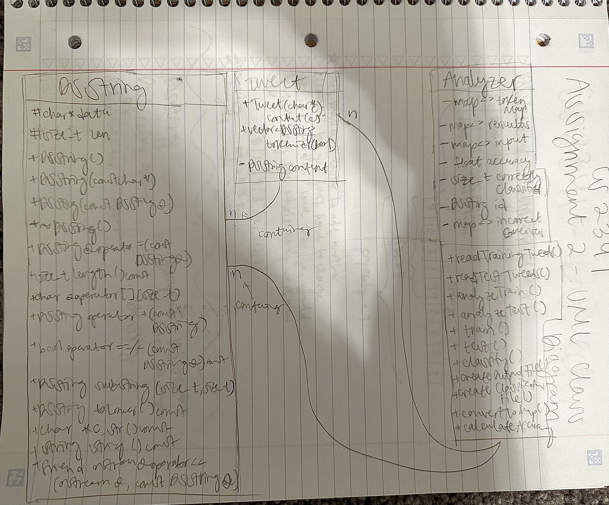

# Assignment 2: Answers

**Complete this document, commit your changes to Github and submit the repository URL to Canvas.** Keep your answers short and precise.

Your Name: Hamna Tameez

Used free extension: [ ] 24 hrs or [ ] 48 hrs

[ ] Early submission (48 hrs)

[ ] Bonus work. Describe: ...

Place [x] for what applies.

## UML Diagram

Add your UML class diagram here.

Replace the following image with your diagram. You can draw it by hand and take a photo.

## Answers

1. How do you train the model and how do you classify a new tweet? Give a short description of the main steps.

    > I read in all of the tweets in the training file, tokenize each of them, and insert them into a token map, where each word has a designated sentiment value calculated based on the assigned sentiment value of the tweet. To classify a new tweet, I read in the tweets from the test file, tokenize them, and compare the words with the words in the token map from the training phase.

2. How long did your code take for training and what is the time complexity of your training implementation (Big-Oh notation)? Remember that training includes reading the tweets, breaking it into words, counting, ... Explain why you get this complexity (e.g., what does `N` stand for and how do your data structures/algorithms affect the complexity).

   > 470678 microseconds. The time complexity is O(Nlog(N)) where N = number of elements in the words map. The main algorithm which affects this the insertion of an element and key into the map of tokens, which is dependent on the number of words in the tweets.

3. How long did your code take for classification and what is the time complexity of your classification implementation (Big-Oh notation)? Explain why.

   > 2567438 microseconds. The time complexity is O(N^2) where N = number of elements in a map. This is because we compare each element in input to each element in results to see if it was correctly classified. 

4. How do you know that you use proper memory management? I.e., how do you know that you do not have
   a memory leak?

   > I ran it through valgrind and did not notice any memory leaks.

5. What was the most challenging part of the assignment?

   > The knowledge gap I needed to overcome in order to complete this assignment. I think I was not as prepared as I should have been from my previous classes. I wish I was introduced to data structures and more complex algorithms earlier.